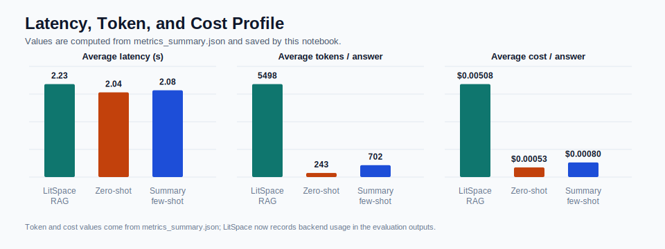
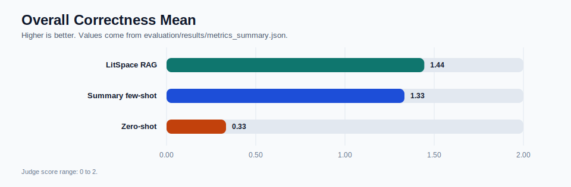
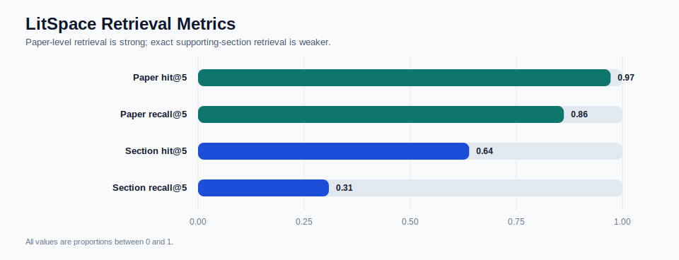
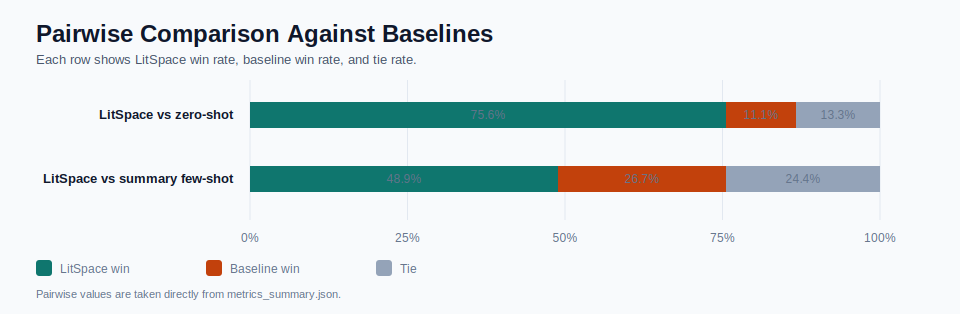
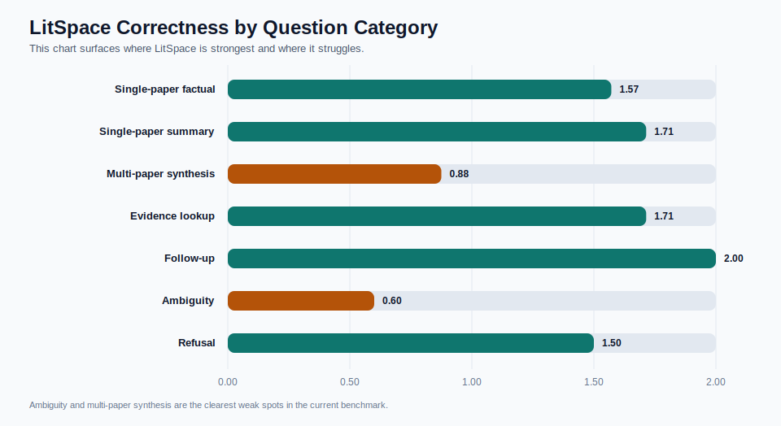
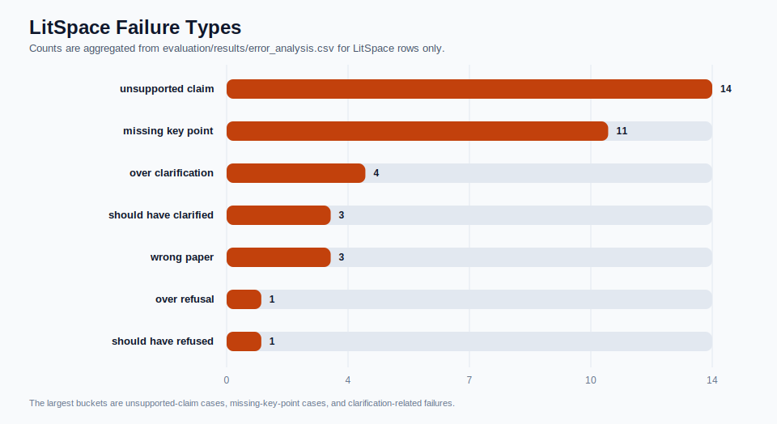
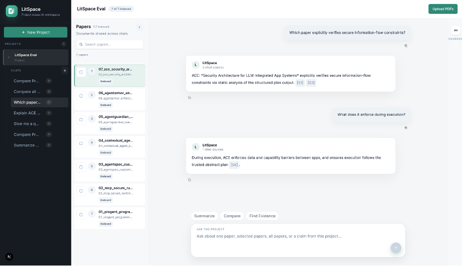
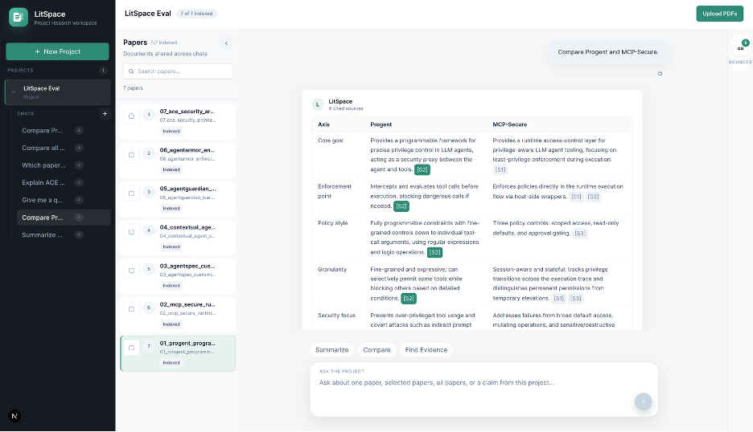

<a id="readme-top"></a>

<div align="center">
  <h1>LitSpace</h1>
  <p><strong>A grounded multi-paper research workspace for academic PDFs, built for project-bounded question answering, paper comparison, and evidence tracing.</strong></p>
  <p>
    <a href="demo/quick_demo.py"><strong>Quick Demo</strong></a>
    &middot;
    <a href="evaluation/notebooks/evaluation_analysis.ipynb"><strong>Evaluation Notebook</strong></a>
    &middot;
    <a href="evaluation/results/metrics_summary.csv"><strong>Results</strong></a>
  </p>
  <p>
    <a href="#quick-start"><strong>Quick Start</strong></a>
    &middot;
    <a href="#system-architecture-overview"><strong>Architecture</strong></a>
    &middot;
    <a href="#model-choices"><strong>Model Choices</strong></a>
    &middot;
    <a href="#evaluation-design-summary"><strong>Evaluation</strong></a>
    &middot;
    <a href="#main-results-summary"><strong>Main Results</strong></a>
    &middot;
    <a href="#latency-token-and-cost-profile"><strong>Latency / Cost</strong></a>
    &middot;
    <a href="#limitations-and-edge-cases"><strong>Limitations</strong></a>
  </p>
</div>

<details>
  <summary>Table of Contents</summary>
  <ol>
    <li><a href="#about-the-project">About The Project</a></li>
    <li><a href="#motivation--problem-statement">Motivation / Problem Statement</a></li>
    <li><a href="#features">Features</a></li>
    <li><a href="#system-architecture-overview">System Architecture Overview</a></li>
    <li><a href="#design-decisions">Design Decisions</a></li>
    <li><a href="#model-choices">Model Choices</a></li>
    <li><a href="#built-with">Built With</a></li>
    <li><a href="#repository-structure">Repository Structure</a></li>
    <li><a href="#quick-start">Quick Start</a></li>
    <li><a href="#getting-started">Getting Started</a></li>
    <li><a href="#prerequisites">Prerequisites</a></li>
    <li><a href="#virtual-environments">Virtual Environments</a></li>
    <li><a href="#installation">Installation</a></li>
    <li><a href="#environment-variables-and-configuration">Environment Variables and Configuration</a></li>
    <li><a href="#running-the-backend">Running the Backend</a></li>
    <li><a href="#running-the-frontend">Running the Frontend</a></li>
    <li><a href="#quick-demo">Quick Demo</a></li>
    <li><a href="#running-the-evaluation">Running the Evaluation</a></li>
    <li><a href="#evaluation-design-summary">Evaluation Design Summary</a></li>
    <li><a href="#what-the-metrics-mean">What the Metrics Mean</a></li>
    <li><a href="#main-results-summary">Main Results Summary</a></li>
    <li><a href="#latency-token-and-cost-profile">Latency, Token, and Cost Profile</a></li>
    <li><a href="#example-prompts--example-usage">Example Prompts / Example Usage</a></li>
    <li><a href="#screenshots">Screenshots</a></li>
    <li><a href="#limitations-and-edge-cases">Limitations and Edge Cases</a></li>
    <li><a href="#ethical-considerations">Ethical Considerations</a></li>
    <li><a href="#future-improvements">Future Improvements</a></li>
    <li><a href="#final-report">Final Report</a></li>
  </ol>
</details>

## About The Project

LitSpace is a project-bounded RAG workspace for a small academic paper corpus. A user creates a project, uploads PDFs, parses and chunks them, builds project-specific indexes, and asks questions that stay grounded in the uploaded sources. The system is built for research-style workflows rather than general web chat.

The main use cases are:

- summarizing one paper
- comparing multiple papers
- finding evidence for a claim
- following up on earlier questions inside the same chat
- staying inside the uploaded project scope instead of drifting into open-domain answers

This repository contains the full stack:

- `backend/`: FastAPI backend for ingestion, retrieval, answering, and persistence
- `frontend/`: Next.js workspace UI for projects, papers, chats, and sources
- `evaluation/`: benchmark data, baselines, judge scripts, pairwise comparison, notebook analysis, and results
- `demo/`: quick demo script plus a 7-paper demo corpus
- `data/`: SQLite metadata, raw PDFs, processed JSON, and indexes

The current evaluation corpus focuses on LLM-agent security papers, but the system architecture is not tied to that domain. The ingestion, parsing, chunking, indexing, retrieval, and answering pipeline is generic enough to support other small academic or document-heavy corpora with the same workflow. That design choice matters because the project is not just a one-off benchmark script. It is meant to be a reusable workspace pattern.

<p align="right">(<a href="#readme-top">back to top</a>)</p>

## Motivation / Problem Statement

Many paper assistants stop at one-document summarization or vague chat over uploaded files. That is not enough for a realistic research workflow. A useful system should:

- stay scoped to the uploaded corpus
- support multiple papers rather than one-off summaries
- show evidence, not only answers
- handle comparisons, follow-up questions, ambiguity, and out-of-scope requests

LitSpace was built around that problem. The core question behind the project is:

> Given a small, curated project corpus, can a project-bounded RAG workspace answer questions more accurately than prompt-only baselines while staying grounded in the uploaded sources?

That makes the project both a product problem and an evaluation problem. It is not enough for the app to return fluent text. It has to retrieve the right paper, recover useful evidence, answer clearly, and avoid answering outside the project scope.

<p align="right">(<a href="#readme-top">back to top</a>)</p>

## Features

- Project-scoped workspaces with persistent metadata in SQLite
- Multi-PDF upload flow with parse, chunk, and index stages
- Hybrid retrieval using semantic search, BM25 lexical search, and reciprocal rank fusion
- Grounded answers with cited source IDs and supporting excerpts
- Chat persistence for follow-up questions inside a project
- Paper selection controls so answers can target one paper, selected papers, or the full project
- Source inspection panel for reading the evidence behind an answer
- Quick actions in the UI for summarize, compare, and evidence lookup prompts
- Benchmark-driven evaluation with baselines, judge metrics, pairwise comparison, and error analysis

<p align="right">(<a href="#readme-top">back to top</a>)</p>

## System Architecture Overview

LitSpace follows a project-bounded RAG pipeline:

1. The user creates a project in the frontend.
2. PDFs are uploaded to the backend and stored under `data/raw/`.
3. The backend parses each PDF with PyMuPDF and stores processed JSON under `data/processed/`.
4. The backend chunks the parsed document into retrieval-ready sections with page and heading metadata.
5. The backend builds project-specific indexes:
   - Chroma for semantic retrieval
   - BM25 JSON payloads for lexical retrieval
6. At query time, the backend retrieves candidate chunks from both retrievers and merges them with reciprocal rank fusion.
7. The answering layer builds a grounded prompt, applies routing logic for answer vs clarify vs refuse, calls the configured LLM provider chain, and returns an answer plus cited sources.
8. The frontend renders the answer, selected paper scope, and supporting evidence.

Main API surfaces:

- `POST /projects`
- `POST /projects/{project_id}/papers/upload`
- `POST /papers/{paper_id}/parse`
- `POST /papers/{paper_id}/chunk`
- `POST /projects/{project_id}/index`
- `POST /projects/{project_id}/ask`
- `POST /projects/{project_id}/retrieve`
- `POST /projects/{project_id}/chats`

<p align="right">(<a href="#readme-top">back to top</a>)</p>

## Design Decisions

### 1. Project-bounded retrieval instead of open-domain chat

LitSpace only answers from the uploaded project corpus. This keeps the system aligned with a real research workflow and makes failures easier to interpret.

Why this choice was made:

- answers can cite actual uploaded papers
- scope violations can be treated as refusals instead of hallucinations
- evaluation can use a fixed golden set rather than vague user impressions
- the product matches the course goal of building something meaningful and honestly evaluating it

### 2. Hybrid retrieval instead of semantic-only retrieval

The backend combines:

- Chroma semantic retrieval
- BM25 lexical retrieval
- reciprocal rank fusion in `backend/app/services/retrieval/pipeline.py`

Why this choice was made:

- semantic search helps with paraphrased queries
- lexical retrieval helps with exact paper names, section terms, and domain vocabulary
- the benchmark mixes factual lookup, comparison, and evidence-heavy queries, so one retriever alone would be weaker

### 3. Grounded source display instead of plain-text answers

Answers return `used_sources`, and the frontend includes a source panel for inspecting the evidence behind the current answer.

Why this matters:

- the system is easier to trust and debug
- evaluation can separate retrieval quality from answer quality
- failure cases become easier to analyze because the evidence is visible

### 4. Persisted chats instead of one-shot prompts

Projects, chats, and messages are stored locally in SQLite. That lets LitSpace support follow-up questions instead of treating each query as isolated.

Why this matters:

- follow-up questions are part of the benchmark
- the workspace model fits research use better than a stateless demo
- some of the most useful queries depend on previous turns, especially comparisons and follow-up evidence requests

### 5. Explicit answer routing

The backend distinguishes between three actions:

- `answer`
- `clarify`
- `refuse`

Why this matters:

- ambiguous requests should trigger clarification, not random guessing
- clearly out-of-project questions should be refused explicitly
- in-project questions with weak support should be treated differently from out-of-scope questions
- this behavior is important both for product quality and for fair evaluation

### 6. Benchmark-first evaluation instead of demo-only validation

The repository includes:

- a 45-question benchmark
- two prompt-only baselines
- LLM judge scoring
- pairwise judging
- direct retrieval metrics
- row-level error analysis
- a notebook that regenerates plots and interprets the results

Why this matters:

- the project is not judged by a few hand-picked demo examples
- retrieval and generation are measured separately
- failure modes are visible instead of hidden behind one average number
- the final story is about what worked, what did not, and why

<p align="right">(<a href="#readme-top">back to top</a>)</p>

## Model Choices

### Embedding model: `BAAI/bge-base-en-v1.5`

LitSpace uses `BAAI/bge-base-en-v1.5` for embeddings.

Why this model exactly:

- it is a strong general-purpose embedding model for semantic retrieval without being so large that it becomes impractical for a class-project workflow
- it gives a better semantic signal than smaller lightweight models, which matters because the benchmark includes paraphrased factual questions, comparison questions, and evidence lookup rather than only exact keyword search
- the project needed a model family that is well-known, reproducible, and easy to run through `sentence-transformers`
- the final results support the choice: paper-level retrieval became one of the strongest parts of the system, which means embedding quality was strong enough that retrieval stopped being the main bottleneck at the paper level

Why this model family makes sense for the project:

- the `bge` family is widely used for retrieval tasks
- it works well with a hybrid retrieval setup where embeddings handle semantic similarity and BM25 handles exact lexical overlap
- the base-size variant gives a practical balance between retrieval quality and local feasibility

### LitSpace generation model: `gpt-5.4-mini`

In the main LitSpace application path, the system uses `gpt-5.4-mini` as the primary generation model.

Why this model exactly:

- it was strong enough to produce useful grounded answers, follow-up responses, and comparison answers without making the system too slow or too expensive for repeated development and evaluation
- the project needed a model that could handle project-bounded QA, evidence-based answers, clarification behavior, and multi-turn context while still being practical for many reruns
- a larger model could have improved some answer quality, but it would also have made experimentation, debugging, and full evaluation runs more expensive
- this choice kept the project focused on system design, retrieval quality, routing, and grounding rather than turning the project into a pure model-size comparison

Why this was a good fit for LitSpace specifically:

- LitSpace is not an open-domain assistant. It is a bounded document QA system, so the generation model does not need to solve the task from world knowledge alone
- once retrieval quality became strong, the main job of generation was to stay grounded, synthesize retrieved evidence, and respond appropriately to ambiguity or scope
- `gpt-5.4-mini` was a reasonable balance of answer quality, latency, and cost for that role
- the final evaluation supports this decision: LitSpace ended up outperforming the simpler baselines overall, which suggests the main gains came from the full system design rather than from using a much larger model

### Application generation path: provider chain with OpenAI first and Ollama fallback

The backend is designed around a provider chain rather than one hardcoded model. In the example backend configuration, the chain is:

```bash
LLM_PROVIDER_CHAIN=openai,ollama
```

The local fallback example uses:

```bash
OLLAMA_MODEL=qwen3:8b
```

Why this setup was chosen:

* OpenAI is used as the strong hosted path when available
* Ollama fallback keeps the app usable in local development or lower-connectivity settings
* the repository stays flexible because generation is provider-configurable rather than hardcoded deep in the pipeline
* this makes the architecture ready for future experiments with other providers or different domains without changing the ingestion or retrieval stack

Why this is good project design:

* it separates system behavior from a single vendor lock-in choice
* it supports the class-project requirement that design decisions should be explained, not just used by default
* it makes the project more reproducible because the generation backend can be swapped while keeping the rest of the pipeline stable

### Baseline model choice: `gpt-5.4-mini`

The evaluation baselines use:

* `ZERO_SHOT_MODEL=gpt-5.4-mini`
* `SUMMARY_FEW_SHOT_MODEL=gpt-5.4-mini`

Why this exact model was used for both baselines:

* using the same model for both baselines keeps the comparison fair
* the goal of the baseline is not to win by raw model size, but to test what happens without retrieval or with only summary-card prompting
* `gpt-5.4-mini` is strong enough to produce coherent answers, but still cheap and fast enough to run repeatedly over the full benchmark
* this keeps the evaluation focused on the real question: how much LitSpace gains from retrieval, routing, scope control, and evidence grounding, not just from paying for a bigger model

Why a smaller strong model is the right baseline here:

* it reduces cost across repeated evaluation runs
* it keeps latency manageable
* it avoids turning the baseline into a pure model-scale contest

### Judge model choice: `gpt-5.4`

The evaluation judge uses:

* `JUDGE_MODEL=gpt-5.4`

Why a stronger judge model was used:

* judging is a different task from baseline generation
* the judge needs to compare answers, read reference answers, look at required points, and assign structured labels consistently
* using a stronger judge model improves stability for scoring and pairwise comparison
* the judge is not part of the product path, so it makes sense to spend more quality budget here than on the prompt-only baselines

### Why the project is still ready for other model choices later

The important point is that the project is not tightly coupled to one exact model everywhere. The architecture separates:

* embedding choice
* retrieval logic
* answering provider chain
* evaluation baselines
* judge model

That makes it easier to rerun the same project with different embedding models, local generation models, or hosted generation models later without redesigning the whole system.


<p align="right">(<a href="#readme-top">back to top</a>)</p>

## Built With

- Frontend: Next.js, React, TypeScript, Tailwind CSS
- Backend: FastAPI, SQLAlchemy, SQLite
- PDF parsing: PyMuPDF
- Retrieval: Chroma, `rank-bm25`, reciprocal rank fusion
- Embeddings: `sentence-transformers` with `BAAI/bge-base-en-v1.5`
- Generation providers supported by the backend: OpenAI, Ollama, Gemini, Anthropic
- Evaluation: Python scripts, OpenAI judge models, CSV/JSONL outputs, notebook analysis

<p align="right">(<a href="#readme-top">back to top</a>)</p>

## Repository Structure

```text
litspace/
├── backend/
│   ├── app/
│   ├── requirements.txt
│   ├── .env.example
│   └── .litenv/
├── frontend/
│   ├── src/
│   ├── public/
│   ├── package.json
│   └── .env.local
├── demo/
│   ├── corpus/
│   ├── screenshots/
│   └── quick_demo.py
├── evaluation/
│   ├── corpus/
│   ├── datasets/
│   ├── notebooks/
│   ├── outputs/
│   ├── results/
│   ├── scripts/
│   └── .env.example
├── data/
│   ├── raw/
│   ├── processed/
│   ├── indexes/
│   └── litspace.db
├── collected_papers/
│   └── llm_privacy/
├── docs/
│   └── final_report.pdf
└── README.md
```

<p align="right">(<a href="#readme-top">back to top</a>)</p>

## Quick Start

This is the fastest path to get LitSpace running locally.

### 1. Create and activate the backend virtual environment

```bash
cd backend
python3.11 -m venv .litenv
source .litenv/bin/activate
pip install -r requirements.txt
```

### 2. Set up backend environment variables

```bash
cp .env.example .env
```

Fill in the values you need, especially any API keys and provider settings.

### 3. Install frontend dependencies

```bash
cd ../frontend
npm install
```

### 4. Set frontend API base

Create `frontend/.env.local` with:

```bash
NEXT_PUBLIC_API_BASE=http://127.0.0.1:8000
```

### 5. Start the backend

```bash
cd ../backend
source .litenv/bin/activate
uvicorn app.main:app --reload
```

### 6. Start the frontend

In a new terminal:

```bash
npm --prefix frontend run dev
```

### 7. Open the app

```text
http://localhost:3000
```

### 8. Optional: run the quick demo

From the repo root:

```bash
backend/.litenv/bin/python demo/quick_demo.py
```

<p align="right">(<a href="#readme-top">back to top</a>)</p>

## Getting Started

The full local workflow is:

1. install backend and frontend dependencies
2. configure environment files
3. start the backend
4. start the frontend
5. create a project and upload papers
6. optionally run the quick demo
7. optionally run the full evaluation pipeline to reproduce benchmark artifacts

<p align="right">(<a href="#readme-top">back to top</a>)</p>

## Prerequisites

- Python 3.11
- Node.js and npm
- an OpenAI API key if you want to use the OpenAI provider or run the evaluation judge scripts
- optional: Ollama for local fallback

If you want local fallback without OpenAI, the backend example config expects Ollama running locally and a compatible model such as:

```bash
ollama pull qwen3:8b
```

<p align="right">(<a href="#readme-top">back to top</a>)</p>

## Virtual Environments

LitSpace uses two separate Python environments.

### Backend environment

Used for the application itself:

```bash
cd backend
python3.11 -m venv .litenv
source .litenv/bin/activate
```

### Evaluation environment

Used for benchmark scripts and judge evaluation:

```bash
cd evaluation
python3.11 -m venv .evalenv
source .evalenv/bin/activate
pip install openai requests python-dotenv pandas pymupdf
```

Using separate environments keeps app dependencies and evaluation dependencies cleanly separated.

<p align="right">(<a href="#readme-top">back to top</a>)</p>

## Installation

### Backend

```bash
cd backend
python3.11 -m venv .litenv
source .litenv/bin/activate
pip install -r requirements.txt
```

### Frontend

```bash
cd frontend
npm install
```

### Evaluation

```bash
cd evaluation
python3.11 -m venv .evalenv
source .evalenv/bin/activate
pip install openai requests python-dotenv pandas pymupdf
```

<p align="right">(<a href="#readme-top">back to top</a>)</p>

## Environment Variables and Configuration

### Backend configuration

Copy `backend/.env.example` to `backend/.env`.

Important backend settings:

- storage paths: `DATA_DIR`, `RAW_PDF_DIR`, `PROCESSED_DIR`, `INDEX_DIR`, `SQLITE_PATH`
- embeddings: `EMBEDDING_MODEL`
- provider chain: `LLM_PROVIDER`, `LLM_FALLBACK_ENABLED`, `LLM_PROVIDER_CHAIN`
- OpenAI: `OPENAI_API_KEY`, `OPENAI_MODEL`, `OPENAI_BASE_URL`
- Ollama: `OLLAMA_BASE_URL`, `OLLAMA_MODEL`
- answer defaults: `DEFAULT_ANSWER_TOP_K`, `DEFAULT_ANSWER_MAX_TOKENS`, `DEFAULT_ANSWER_TEMPERATURE`

### Frontend configuration

The frontend reads `frontend/.env.local`. A standard local setup is:

```bash
NEXT_PUBLIC_API_BASE=http://127.0.0.1:8000
```

### Evaluation configuration

Copy `evaluation/.env.example` to `evaluation/.env`.

Important evaluation settings:

- `OPENAI_API_KEY`
- `LITSPACE_API_BASE`
- `LITSPACE_EVAL_PROJECT_ID`
- `ZERO_SHOT_MODEL`
- `SUMMARY_FEW_SHOT_MODEL`
- `JUDGE_MODEL`
- `LITSPACE_TOP_K`
- `LITSPACE_MAX_OUTPUT_TOKENS`
- `LITSPACE_TEMPERATURE`

<p align="right">(<a href="#readme-top">back to top</a>)</p>

## Running the Backend

From the repository root:

```bash
cd backend
source .litenv/bin/activate
uvicorn app.main:app --reload
```

The backend runs on `http://127.0.0.1:8000`.

<p align="right">(<a href="#readme-top">back to top</a>)</p>

## Running the Frontend

From the repository root:

```bash
npm --prefix frontend run dev
```

Open:

```text
http://localhost:3000
```

<p align="right">(<a href="#readme-top">back to top</a>)</p>

## Quick Demo

The main demo command is:

```bash
backend/.litenv/bin/python demo/quick_demo.py
```

What it does:

- starts the backend automatically if needed
- creates a temporary project from the 7 PDFs in `demo/corpus/`
- uploads, parses, chunks, and indexes those papers
- creates a chat
- asks 3 example questions
- prints the answers in a readable terminal format
- deletes the temporary project at the end
- stops the backend at the end if the script started it

Static fallback:

```bash
backend/.litenv/bin/python demo/quick_demo.py --static
```

That path prints committed examples from `evaluation/outputs/litspace_outputs.jsonl` without creating a project.

<p align="right">(<a href="#readme-top">back to top</a>)</p>

## Running the Evaluation

The evaluation harness treats LitSpace as a black-box system. Run these commands from the repository root in order:

```bash
backend/.litenv/bin/python evaluation/scripts/setup_project.py
backend/.litenv/bin/python evaluation/scripts/run_systems.py
backend/.litenv/bin/python evaluation/scripts/judge_answers.py
backend/.litenv/bin/python evaluation/scripts/pairwise_judge.py
backend/.litenv/bin/python evaluation/scripts/summarize_results.py
```

What each script does:

- `setup_project.py`: creates a fresh evaluation project from `evaluation/corpus/`
- `run_systems.py`: runs LitSpace, `zero_shot`, and `summary_few_shot`
- `judge_answers.py`: scores answers with an LLM judge
- `pairwise_judge.py`: compares LitSpace against each baseline head-to-head
- `summarize_results.py`: aggregates all metrics into `evaluation/results/`

Outputs are saved under:

- `evaluation/outputs/`
- `evaluation/results/metrics_summary.csv`
- `evaluation/results/metrics_summary.json`
- `evaluation/results/error_analysis.csv`
- `evaluation/results/plots/`

The narrative walkthrough lives in:

- `evaluation/notebooks/evaluation_analysis.ipynb`

<p align="right">(<a href="#readme-top">back to top</a>)</p>

## Evaluation Design Summary

The evaluation setup is based on committed project artifacts, not just ad hoc manual examples.

### Benchmark

- size: `45` questions
- dataset file: `evaluation/datasets/questions.csv`
- categories:
  - `single_paper_factual`
  - `single_paper_summary`
  - `multi_paper_synthesis`
  - `evidence_lookup`
  - `followup`
  - `ambiguity`
  - `refusal`

### Baselines

- `zero_shot`
- `summary_few_shot`

The baseline code lives in `evaluation/scripts/run_systems.py`. The summary few-shot baseline uses summary cards from `evaluation/datasets/paper_summaries.json`.

### Why these baselines were used

- `zero_shot` answers from prompting alone, so it shows what happens without retrieval
- `summary_few_shot` is a stronger prompt-only baseline because it gets compressed paper summaries and examples, but still does not retrieve evidence at query time
- LitSpace is the full system under test, so the comparison answers the real question: what does retrieval plus scope-aware routing buy over prompt-only setups

### Metrics tracked

The project evaluates both retrieval and generation:

- retrieval metrics:
  - `paper_hit_at_5`
  - `paper_recall_at_5`
  - `section_hit_at_5`
  - `section_recall_at_5`
  - `paper_mrr_at_5`
- answer quality metrics:
  - correctness
  - completeness
  - relevance
  - helpfulness
  - faithfulness
  - follow-up success
- efficiency and instrumentation metrics:
  - average latency
  - latency confidence interval
  - average input tokens
  - average output tokens
  - average estimated API cost
- routing and scope-control metrics:
  - answered rate
  - clarified rate
  - refused rate
  - over-clarification rate
  - over-refusal rate
  - clarification accuracy
  - refusal accuracy
- pairwise win rates
- row-level failure labels in `evaluation/results/error_analysis.csv`

This separation matters because it shows whether mistakes come from retrieving the wrong evidence, using incomplete evidence, or generating weak answers from otherwise relevant retrieval results.

<p align="right">(<a href="#readme-top">back to top</a>)</p>

## What the Metrics Mean

### Retrieval metrics

- **paper_hit@5**: whether the correct paper appears anywhere in the top 5 retrieved hits
- **paper_recall@5**: how much of the expected paper set is recovered in the top 5 hits
- **section_hit@5**: whether at least one expected supporting section appears in the top 5 hits
- **section_recall@5**: how much of the expected section set is recovered in the top 5 hits
- **paper_mrr@5**: how early the first correct paper appears, with higher values meaning better ranking

Why this matters:

- paper-level metrics tell us whether retrieval found the right document
- section-level metrics tell us whether retrieval found the right evidence inside that document
- the project’s later results show that paper retrieval is strong, while section retrieval is still the weaker part

### Judge metrics

- **correctness**: whether the answer gets the core content right
- **completeness**: whether it covers the needed points rather than only part of them
- **relevance**: whether the answer stays on the actual question
- **helpfulness**: whether the answer is useful to the user rather than evasive or thin
- **faithfulness**: whether the answer is supported by the provided evidence or grounded context
- **follow-up success**: whether the system handles multi-turn continuation correctly

### Pairwise win rate

This compares two systems directly on the same question and asks the judge which answer is better. It helps because averages alone do not show which system is preferred example by example.

### Latency, token, and cost metrics

- **average latency**: average wall-clock response time per benchmark question
- **latency CI95**: approximate 95% confidence interval around the average latency
- **average input tokens**: average prompt/context tokens sent to the model for each answer
- **average output tokens**: average generated answer tokens returned by the model
- **average cost**: estimated API cost per answer from recorded token usage and the configured model pricing constants in `evaluation/scripts/run_systems.py`

The evaluation records latency, token usage, provider/model metadata, and estimated API cost for the current LitSpace and baseline runs. LitSpace uses more input tokens because it includes retrieved evidence in the prompt; the baselines use shorter direct prompts or prewritten summary cards.

### Routing and scope-control metrics

- **answered rate**: share of benchmark examples where the system gave an answer
- **clarified rate**: share where the system asked the user to clarify
- **refused rate**: share where the system refused because the request was outside scope or unsupported
- **over-clarification rate**: share of answerable examples where the system clarified unnecessarily
- **over-refusal rate**: share of answerable examples where the system refused unnecessarily

<p align="right">(<a href="#readme-top">back to top</a>)</p>

## Main Results Summary

### Core results table

| System | Correctness | Completeness | Relevance | Helpfulness | Faithfulness | Avg latency (s) |
| --- | ---: | ---: | ---: | ---: | ---: | ---: |
| LitSpace RAG | 1.42 | 1.27 | 1.71 | 1.42 | 1.44 | 2.23 |
| Summary few-shot | 1.33 | 1.02 | 1.82 | 1.27 | 1.82 | 2.08 |
| Zero-shot | 0.33 | 0.22 | 1.22 | 0.31 | N/A | 2.04 |

This table shows LitSpace clearly beating zero-shot. That gap is large enough that retrieval, scope control, and evidence grounding are doing real work. The stronger baseline is `summary_few_shot`, and that comparison is closer. LitSpace is better on correctness, completeness, and helpfulness, while summary few-shot is stronger on relevance and faithfulness.

Why that pattern makes sense:

- the summary baseline is given compressed paper summaries, so it can sound clean and on-topic
- LitSpace has to retrieve evidence at query time, which makes it stronger on grounded answering but also exposes it to retrieval and routing errors
- this is exactly the kind of tradeoff the project was meant to study

### Retrieval table

| Metric | LitSpace |
| --- | ---: |
| Paper hit@5 | 0.97 |
| Paper recall@5 | 0.86 |
| Section hit@5 | 0.64 |
| Section recall@5 | 0.31 |
| Paper MRR@5 | 0.95 |

Paper retrieval is strong. LitSpace usually finds the right paper and often ranks it near the top. Section retrieval is weaker, especially recall. That matters because retrieval is no longer the main bottleneck at the paper level. The harder part is recovering the exact supporting evidence inside the right paper and turning it into a complete answer.

### Pairwise results table

| Comparison | LitSpace win rate | Baseline win rate | Tie rate |
| --- | ---: | ---: | ---: |
| LitSpace vs zero-shot | 0.756 | 0.111 | 0.133 |
| LitSpace vs summary few-shot | 0.489 | 0.267 | 0.244 |

These pairwise results say the same basic thing in a more example-by-example way. LitSpace is clearly preferred over zero-shot. Against summary few-shot, it still comes out ahead, but the margin is smaller and the tie rate is meaningful. That tells us the stronger baseline is a real competitor.

### Category highlights

| Category | LitSpace correctness |
| --- | ---: |
| Follow-up | 2.00 |
| Evidence lookup | 1.57 |
| Single-paper summary | 1.71 |
| Single-paper factual | 1.57 |
| Refusal | 1.50 |
| Multi-paper synthesis | 0.88 |
| Ambiguity | 0.60 |

The best categories are follow-up, single-paper summary, evidence lookup, and single-paper factual tasks. The weakest categories are ambiguity and multi-paper synthesis. Those weaker categories ask more from the system than simple retrieval: better scope resolution, better section coverage, and better answer composition across multiple sources.

### Error analysis

Top failure types from `evaluation/results/error_analysis.csv`:

| Failure type | Count |
| --- | ---: |
| Unsupported claim | 14 |
| Missing key point | 11 |
| Over-clarification | 4 |
| Wrong paper | 3 |
| Should have clarified | 3 |
| Over-refusal | 1 |
| Should have refused | 1 |

The error analysis matches the retrieval results. A lot of the mistakes are not total failures. The system is often in the right area, but the final answer is either missing a key point or not grounded tightly enough. That is why the limitations section below focuses heavily on section retrieval, answer composition, and routing edge cases instead of pretending the whole system fails equally everywhere.

### Routing table

| Metric | LitSpace RAG | Summary few-shot | Zero-shot |
| --- | ---: | ---: | ---: |
| Answered rate | 0.711 | 0.778 | 0.756 |
| Clarified rate | 0.156 | 0.133 | 0.244 |
| Refused rate | 0.133 | 0.089 | 0.000 |
| Over-clarification rate | 0.125 | 0.050 | 0.175 |
| Over-refusal rate | 0.073 | 0.000 | 0.000 |
| Clarification accuracy | 0.400 | 0.800 | 0.800 |
| Refusal accuracy | 0.750 | 1.000 | 0.000 |

These values show that LitSpace uses the project boundary more explicitly than the baselines. That is useful for refusing out-of-scope requests, but it also creates routing risk: the system can over-clarify or over-refuse when a grounded answer was possible.

### Latency, Token, and Cost Profile

| System | Avg latency (s) | Latency CI95 | Avg input tokens | Avg output tokens | Avg cost / answer |
| --- | ---: | ---: | ---: | ---: | ---: |
| LitSpace RAG | 2.23 | 0.57 | 5242.22 | 256.09 | $0.00508 |
| Summary few-shot | 2.08 | 0.29 | 629.67 | 72.80 | $0.00080 |
| Zero-shot | 2.04 | 0.25 | 150.58 | 92.29 | $0.00053 |



This plot and table are generated from `evaluation/notebooks/evaluation_analysis.ipynb`. LitSpace now has token and cost values in the current evaluation results. It uses many more input tokens than the prompt-only baselines because the RAG path sends retrieved source evidence and grounding instructions into the model. That is a deliberate quality tradeoff: the system spends more context to answer from the uploaded papers instead of relying on prompt-only memory.

The cost values are per-answer averages for this benchmark and model configuration. They are useful for comparing these three runs, but they should not be treated as universal production costs because corpus size, top-k retrieval, answer length, model choice, and follow-up length can all change the numbers.

Token and cost averages are computed only for rows where provider usage was reported. For LitSpace, no-generation clarify/refuse responses do not have token usage.

### Evaluation visuals

#### Overall answer quality



LitSpace is clearly ahead of zero-shot. The more useful comparison is with summary few-shot, where the lead is real but smaller.

#### Retrieval performance



Paper retrieval is strong, but section retrieval is weaker. That gap shows up again in the failure analysis.

#### Pairwise wins



The pairwise view confirms that LitSpace usually beats zero-shot and is still ahead of the stronger baseline, just by a narrower margin.

#### Category breakdown



The category plot makes the weak spots easy to see: ambiguity and multi-paper synthesis.

#### Failure types



Unsupported claims and missing key points are the main failure buckets, which means the current system still loses precision after retrieval.

For the full step-by-step interpretation, see:

- `evaluation/notebooks/evaluation_analysis.ipynb`

<p align="right">(<a href="#readme-top">back to top</a>)</p>

## Example Prompts / Example Usage

These prompts match the current product and benchmark well:

- `Summarize Progent in one short paragraph: goal, method, and main result.`
- `What is the main difference between Progent and MCP-Secure in how they enforce runtime access control?`
- `Which paper uses program dependence graphs to represent runtime traces?`
- `Compare all seven papers in one concise pass.`
- `Focus on goal, method, and limitation.`
- `What evidence does ACE give for secure information-flow enforcement?`

The UI also includes quick actions for:

- `Summarize`
- `Compare`
- `Find Evidence`

<p align="right">(<a href="#readme-top">back to top</a>)</p>

## Screenshots

### Workspace overview



This screenshot shows the main workspace layout with the project sidebar, paper list, chat thread, prompt bar, and a grounded answer with inline source tags.

### Live workspace state



This view shows the system in an active multi-paper workflow with a populated evaluation project, multiple indexed papers, and a grounded answer inside the main chat area.

<p align="right">(<a href="#readme-top">back to top</a>)</p>

## Limitations and Edge Cases

LitSpace works well overall, but the final results make the weak points pretty clear.

### 1. Paper retrieval is stronger than section retrieval

This is one of the most important limitations in the project.

Why it happens:

- the hybrid retriever is very good at finding the right paper
- but finding the exact paragraph or exact supporting section is harder, especially when the question is abstract, multi-part, or comparison-heavy
- academic papers often spread the needed evidence across introduction, method, results, and discussion rather than one clean chunk

Why it matters:

- the system can retrieve the correct paper and still produce an incomplete answer
- this is one reason missing-key-point errors and unsupported-claim errors remain common

### 2. Multi-paper synthesis is still harder than single-paper QA

This shows up clearly in the category breakdown.

Why it happens:

- the system has to retrieve evidence from multiple papers at once
- it then has to compare or synthesize them in one answer without collapsing onto only one paper
- even when the right papers are present, the final answer can still miss an important distinction or under-cover one of the compared papers

Why it matters:

- multi-paper questions are closer to real research use, so this remains an important practical limitation
- this is one of the main places where LitSpace still loses points relative to a cleaner prompt-only summary baseline

### 3. Ambiguity handling is improved but not perfect

The system now has explicit answer, clarify, and refuse routing, but ambiguity is still a difficult category.

Why it happens:

- some requests are genuinely under-specified, like vague pronouns or unclear paper references
- some requests look ambiguous on the surface but are actually answerable project-wide, such as “which paper focuses on...”
- getting that distinction right every time is harder than basic retrieval

Why it matters:

- over-clarification can make the system feel less helpful
- under-clarification can make it guess incorrectly
- this is one reason ambiguity remains one of the weakest evaluation categories

### 4. Unsupported claims can still happen even when retrieval is relevant

This is another major limitation.

Why it happens:

- a retrieved source can be topically relevant without directly supporting the exact detail stated in the answer
- the model can still over-compress, generalize, or blend nearby evidence into a stronger claim than the source justifies
- this gets worse when questions ask for exact limitations, exact evidence, or precise distinctions across papers

Why it matters:

- grounded-looking answers can still overstate what the evidence really supports
- this is why unsupported-claim errors remain one of the largest failure buckets

### 5. Scope routing has edge cases

The project-bounded design is a strength, but it also creates a routing burden.

Why it happens:

- the system has to decide whether a query is answerable from the project, needs clarification, or should be refused
- some cases sit near the boundary, especially when a user asks something broad, partially related, or phrased indirectly

Why it matters:

- a weak refusal can look like an in-project failure instead of a clean scope boundary
- a mistaken clarification can block an otherwise answerable query
- the evaluation improvements in later iterations came partly from fixing this routing problem, which shows how important it is

### 6. Narrow corpus means narrow guarantees

The system was evaluated on a focused corpus of seven LLM-agent security papers.

Why this matters:

- the evaluation is strong for this setup, but it does not prove that performance will transfer unchanged to larger, noisier, or very different corpora
- another domain may have different paper structure, terminology, and evidence patterns
- the architecture is general, but the reported numbers are still specific to this benchmark


<p align="right">(<a href="#readme-top">back to top</a>)</p>

## Ethical Considerations

This project is about grounded research assistance, not high-stakes autonomous decision making. Still, there are real risks.

### 1. Grounded-looking answers can still be over-trusted

A system that cites papers can appear more reliable than it really is. If the user sees source tags and evidence snippets, they may assume the answer is fully supported even when the answer is incomplete or slightly overclaims what the source says.

### 2. Incomplete evidence can still mislead research use

A partially correct answer can still be harmful in a literature review setting. Missing one important limitation or one key methodological distinction can distort how a paper is understood.

### 3. Multi-paper comparison increases the risk of mixing claims

When a system compares several papers at once, it is easier to blur differences or attribute a claim too broadly. That is one reason multi-paper synthesis remains a hard category in the evaluation.

### 4. Narrow corpus bias matters

The current benchmark uses a focused set of papers in one topic area. That makes evaluation manageable, but it also means the system is being tested inside a narrow slice of research language and structure.

### 5. The system should not be used as a replacement for careful reading

LitSpace is best treated as a research aid. It can help locate papers, summarize them, compare them, and surface evidence. It should not be treated as a final authority for high-stakes academic, legal, medical, or policy decisions without direct source verification.

<p align="right">(<a href="#readme-top">back to top</a>)</p>

## Future Improvements

If there were more time, the next improvements would be:

- better section-level retrieval for exact evidence questions
- stronger multi-paper synthesis prompts and evidence organization
- more robust ambiguity handling for underspecified references
- more explicit citation display and source grouping in the UI
- larger and more diverse document corpora beyond the current seven-paper benchmark
- automated backend tests in addition to the benchmark-driven evaluation workflow

<p align="right">(<a href="#readme-top">back to top</a>)</p>

## Final Report

The final write-up is included here:

```text
docs/final_report.pdf
```

<p align="right">(<a href="#readme-top">back to top</a>)</p>
